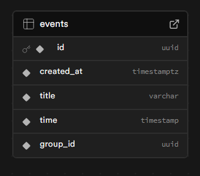

# Calendar Scheduler

## Steps to setup
1. cd into project
2. Install packages using

    ```npm install```
3. Start the server using

    ``` npm run dev ```

## File Structre:
- I wanted to develop the app in a component.modular like fashion which is why I've developed 3 major components:
    1. **CalendarComponent.tsx**
        - This will be the maincomponent that will hold the grid i.e. the calendar.
    2. **EventModalComponent.tsx**
        - This is a Modal made with the help of shadcn to create a new schedule.
    3. **DateTimePicker.tsx**
        - This is a custom date time picker made with the help of calender and input from shadcn. 
        - The time picker is made in such a way that it works only in 12hr format and no wrong time can be entered.
- I've also added a service folder that has the handler for everythign related to supabase such as adding new schedule and get all schedules. It can be found in 
    ```/services/SupabaseServices.tsx```

    1. **getAllEvents**
        - Helps is getting all the event from supabase.
    2. **createEvent**
        - Helps in scheduling a new test.
    3. **getNextOccurrence**
        - A help function that helps in calculating the dates of the upcoming 'day'.
    4. **updateEvent**
        - Helps in updaing schedule test.
        - Can be improved to a batch update in the future as DB is designed with that in mind.
    5. **deleteEvent**
        - Helps in updaing schedule test.
        - Can be improved to a batch delete in the future as DB is designed with that in mind.

## Technologies used:
1. NextJS - Frontend framework
2. Supabase - Database
3. shadcn - UI/UX components
4. lucide - Icons & SVGs
5. TailwindCSS - CSS and stuyling
6. date-fns - Lightweight JS library for dates and calender operations
7. UUID - for greating groupID for group schedule test update and delete

## Database Architecture:


This is a simple architecture used ti track the event i.e. Shecdule tests. I will give a quick rundown of all the attributes:

1. id: varchar - Primary key to uniquly identify a test schedule.
2. created_at: TimeStamp - When the test schedule was created (for logging perpose and audit)
3. title: varchar - title or suite of the scheduled task.
4. time: TimeStamp - Time and Date of when the test is scheduled,
5. group_id: Can be used to update and delte all the tasks that were scheduled together on different days i.e. when I create a task to run on Monday, Wednesday and Friday @ 10:00am and now I want them to run at 2:00pm afternoon I can simply use the group_id to reschedule all of them at one go!

## Test the App at: [App-Link](https://calendar-scheduler-mauve.vercel.app/)